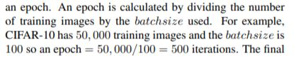
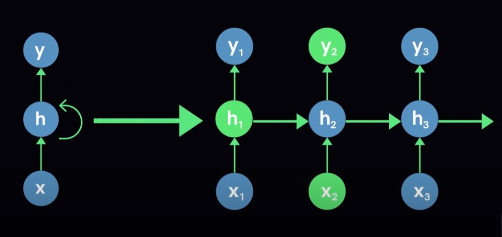

# Deep Learning Crash Course for Beginners

*YouTube video link* : https://www.youtube.com/watch?v=VyWAvY2CF9c&ab_channel=freeCodeCamp.org

## Neural Network General Structure


- **Input layer** : vector of variables [x1, x2, x3, ..., xn], several neurons connected through channels to the next layer, are assigned weights
- **Several hidden layers**
- **Output layer**


## Neural network learning process

### Forward propagation


- **Activation function** : (often noted sigma) decides if the neuron can contribute to the decision

- **Weight** : the higher the value, the more important the decision of the neuron

- **Bias** : to shift the activation function either to the right or to the left


### Back propagation

- From the **output layer** to the **hidden layers** but not to the input layer

- **Loss function** : to quantify the deviation of the predicted output from the actual expected output, this information is sent back from the output layer to the hidden layers to adjust the accuracy of the neural network

### Learning process example


- **Randomly initialize weights** :


- **Each layer has a weight**

- Each layer has a bias **except the input layer**

- Output layer gives a probability of the output being what it is. In the output layer, the neuron which was activated by the activation function will output the final value of the NN (Neural Network), therefore, the activation function must be carefully chosen

- **Back propagation** : adjust the weights and biases previousky given to each concerned layer to decrease the loss function

- **Epoch** : 1 cycle containing 1 forward propagation and 1 back propagation

- **Overfitting** : too much data given to the NN (Neural Network)


## Terminology

- **Activation function** : to introduce non-linearity in the NN and therefore decide whether a neuron can contribute to the final output or not (activated or not). It is based on a **threshold**. Many different activation families of activation functions :

    - **Step function** : based on a threshold, will output either 0 or 1, and the neuron will be activated only if the activation function's output is equal to 1. It proposes a binary activation
    
    *Drawbacks* : when more than one neuron was activated in the output layer by this binary activation function

    - **Linear function** : the slope will determine a value of activation and we would be able to use it by activating the neuron with the highest value, where ```activation = slope * input_value```. It allows range activation instead of binary activation.
    
    *Drawbacks* : the derivative of a linear function is a constant (because the slope does not change), which means x is not taken into account in the process, which means the derivative of the activation function is the same accross all layers which means a single hidden layer would be needed and it would be impossible to stack more layers to improve the model. Combinations of linear functions = linear function : g(f(x)) = linear function if g(x) is linear and f(x) is linear

    - **Sigmoid function** : non linear (we can stack layers now) + analog output instead of binary (range of 0 to 1). Very popular and widely used activation function
    
    *Drawbacks* : a slight change of x value in the range [-2 ; 2] changes y values drastically and on the other hand big changes in other x ranges do not really change y values => **vanishing gradient problem** because when x is in the range ]-infinite ; -2[ U ]2 ; infinite[, the slope of the sigmoid function is almost 0 and the output value of this activation function will always be either 0 or 1 no matter what the value of x would be if it fits these ranges.

    - **Tanh function** : shifted sigmoid function, same characteristics than sigmoid function but has a steeper (bigger) slope than sigmoid function so its derivative is also steeper. Very popular and widely used activation function too
    

    - **ReLu (Rectified Linear Unit) function** : non linear (we can stack layers), no boundaries (unlike the sigmoid and tanh functions) => sparse (more scattered) activation values. *Remark* : using an activation function like sigmoid or tanh would cause multiple activations as the output is in a range of 0 to 1 and this is **very costly**. We want the min number of activations in a NN as there can be a big number of neurons in it => ReLu allows the sparsity of activations as it outputs 0 for negative values of x => 50% of the NN fires (**sparse activation**)
    
    *Drawbacks* : for the negative values of x, as the ReLu function outputs 0, the gradient is equal to 0, meaning that during back propagation, the weights will not be adjusted for the concerned neurons => **dying ReLu problem** => concerned neurons are passive to back propagation as they can't reduce a slope that is already set to 0 (gradient = derivative = 0 for the constant 0 value for negative x values).
    

    - **Leaky ReLu** : same as ReLu but for negative x values, the output is x * coeff with coeff very close to 0 to preserve the computational gain that ReLu gives compared to sigmoid and tanh. Often coeff will be ~0.001, so that the dying ReLu problem is solved
    

    - **Which activation function to choose ?** : the one that would approximate the target function the fastest.
      - Binary classification problems : sigmoid
      - If unsure in general : start with ReLu or modified ReLu
    - **Why do we choose a non-linear activation function ?**
    
    Because no matter how much layers we stack in the NN, a linear activation function will have the same outputs as opposed to the non-linear activation function (equivalent to a single layer NN). It is important so that no matter which data is given we would not be restrained to a straight line only so that we can obtain curves instead.

- **Loss functions** : quantify the deviation between the predicted output and the actual expected output. Different loss functions depending on the project we're working on :


- **Optimizers** : during training, we adjust the parameters to minimize the loss function and make our model as optimized as possible. The optimizers update the model parameters based on the loss function's output, by adjusting the weights and the biases. The loss function therefore guides the optimizers in the process of reducing its value.

    - **Gradient Descent (gd)** : "Granddaddy of optimizers". Iterative algorithm that starts off a random point on the loss function and travels down its slope until it reaches the lowest point (minimum of the loss function). **It uses the entirety of the training set**. It is the most popular, fadt, robust, flexible. Algorithm :
      - Calculate what a small change in each individual weight would do to the loss function => **gradient**
      - Adjust each parameter (weight / bias) based on its gradient
      - Repeat until the loss is at its computed minimum (it is not necessarily the global min, sometimes it's only a local min but the gradient descent algorithm alone can't detect it)
    
    The gradient always points in the direction of the steepest increase of a function. As a result, the gradient descent algorithm will take **gradient * (-1)** and not the gradient itself as an indicator to go down the slope of the loss function as we want to get the steepest decrease of the loss function.
    
    The above process happens iteratively until the loss function has reached its minimum.
    
    When dealing with high dimensional datasets, it is more probable to reach a local minimum instead of the global minimum of the loss function. To avoid getting stuck in a local minimum, we make sure we use the proper **learning rate**. Modifying the parameters (weights / bias) too fast by adding or subtracting too large values can hinder our ability to minimize the loss function as we could end up being under the loss function curve if it looks like the one above or by ending up in regions that are simply not on the curve in general, or we could also end up skipping the best minimum value of the loss function

    - **Learning rate** : usually a small number (~0.001) to take it easy on the loss function optimization and not have the above mentioned problems. The gradients are multiplied by the learning rate to scale them, it ensures that any changes made to the weights are quite small
      - Too large : the gradient descent algorithm will overshoot (simply pass through without noticing it) the global minimum of the loss function
      - Too small : it will take forever to the NN to **converge**, meaning to find the global minimum of the loss function, and even worse, if steps are too small, it could converge towards the local minimum and not have enough epochs to converge towards the global minimum

    - **Stochastic gradient descent (sgd)** : same as gd except **it only takes a subset of the training set** because it is sometimes more efficient to use a subset instead of the entirety of the training examples. It uses **batches** of random training examples on each pass (**epoch**). SGD uses the concept of **momentum**. Because we do not include the entirety of training examples, SGD is less costly in terms of computations

    - **Momentum** : accumulates the the gradients of the past steps to dictate what might happen in the next steps. It works by adding a fraction of the previous gradients to the current one
    
    There atre other types of gradient descent implementations (other than SGD) that are used in NN today :

    - **Adagrad** : adapts learning rate to individual features which means some weights in the dataset will have different learning rates ! It works well on sparse datasets with many input values missing.
    *Drawback* : the learning rate tends to get small over time.

    - **RMSprop** : specialized version of Adagrad. Instead of letting gradients accumulate from momentum, it accumulates them in a fixed window. It is similar to **Adaprop** (other optimizer that seeks to solve issues that Adagrad involves)

    - **Adam (Adaptive Moment Estimation)** : also uses the concept of momentum. Widespread

    - **Which optimizer to choose ?** : by trial and error. They all aim to reduce the loss function anyway :D

- **Parameters and hyperparameters** : a model parameter is a variable that is internal to the NN, its value can be estimated from the data itself. 

  - **Parameters** : are required by the model to make predictions, their values define the model's skill, they can be estimated directly from the data and are **NOT set manually**. They are saved as part of the learnt model. Ex :

    - Weights
    - Biases
    - ...
   
  - **Hyperparameter** : external to the model, **value can not be estimated directly from the data**. We can't find the model's best value for a hyperparameter as it will be set by trial and error. When a deep learning algorithm is **tuned** (using for example **GridSearch** or **RandomSearch**) then it is the hyperparameters that are tuned in order to discover the parameter's values for the most skillful predictions. A hyperparameter is **manually specified** Ex :

    - Learning rate
    - C and sigma in SVMs
    - K in KNNs
    - ...

    

- **Epochs, batches, batch sizes and iterations** : neeeded mostly when the dataset is large (which is often the case actually) because we could not pass all the data to be computed at once. We break the dataset into smaller chunks (subsets) and give it to the NN one chunk by one

    - **Epoch** : when the **entire dataset** is passed forward and backward only once. We use multiple epochs to help the model generalize better as we try to minimize the loss function at each pass / epoch (gradient descent is an iterative process !) with trying the new weights and biases at each epoch.
    *Drawbacks* : too much epochs can lead to **overfitting** which shows the model performing terribly on data it's never seen before.

    - **What is the right number of epochs ?** : no right answer for the moment.

    - **Batch and batch size** : we divide large datasets into smaller batches and feed those batches to the NN.

    - **Batch size** : total number of training examples in a batch

    - **Iterations** : number of batches needed to complete an epoch.
    
    

    - **How many hidden layers should we choose ?** : no right answer for the moment, it is decided by trial and error

## Regularization

- **Core problem in deep learning** : the model should perform well on training data AND on new test data

- **Most common problem faced** : overfitting, sometimes underfitting


### Dropout

- The most popular regularization tool used in deep learning, produces good outputs

- How it works : it randomly selects nodes along the NN and removes them as well as their immediate next-layer connections

- Captures more randomness

- Memorizes less of the training data and hence will be less prone to overfitting


### Dataset augmentation

- Train the NN on more data

- In practice, the amount of data we have access to is limited, so we have to create **fake data** that will be added to the training set

- This approach is easy for **classification**

- It also relies on applying transformations to the current dataset to summarize features if there are too many dimensions

- Very efficient for **object recognition**, where the transformation applied consists of aither :

  - Applying a vector translation to pixels in the provided images
  - Rotating the image
  - Scaling the image

- We must be careful of the transformation applied as, for example, if the task consists of separating b from d or 6 from 9, then we must not rotate the image horizontally or vertically for example


### Early stopping

- Comes from the observation that the training error / loss decreases steadily (progressively) with time but there comes a moment when the validation error / loss increases instead after a certain point

- Stop the training from the point when the validation error / loss begins to overwhelm the training error / loss

- Effective, simple, widely spread

## NN architectures

### Fully-Connected Feed Forward NN

- Each neuron in a layer is connected to all neurons in the next layer

- Neurons inside the same layer are not connected


*Remark* : the increase in computational resources and complexity is NOT linear to the number of neurons of the NN, it increases much much faster !


*Drawbacks* : can't predict the trajectory from a single snapshot for example or guess the meaning behind a single word. **Vanilla NN such as fully-connected feed forward NN can't handle sequential data such as sentences and they don't share parameters accross time**. The last part is important because sharing parameters gives the NN the ability to look for a given feature everywhere in a sequence rather than just in a certain area. It would help, for example, determining that "On tuesday, it is raining" and "it is raining on tuesday" mean the same thing. It would also give the NN the ability to deal with variable length sequences, maintain sequence order, keep track of long-term dependencies and share parameters accross the sequence.

### Recurrent NN (RNN)

- **Feedback loop** : in the hidden layers

- Can operate on sequential data with variable input length




- At a given time, the node hn uses both its input xn AND the state of the previous node hn-1 to predict its output yn (for example here, h2 uses both x2 and the state of h1 to predict y2). It allows parameter sharing

- We can repeat the above described steps for an arbitrary number of times to propagate information by its hidden state
throughout time. It introduces the notion of **sequential memory** (similar to short-term memory)

- Training a RNN : uses the back propagation algorithm like the fully-connected fast forward NN, except the **backdrop** is applied for **each data point in the given sequence**. It is sometimes called the **BTT (Back propagation Through Time**.

- Use case example : intelligent predicting like letter predicting based on previously-typed letters, with the fact that each letter is equally important in terms of prediction


- Each letter typed induces the prediction of a new letter that would be typed by the user, based on the frequency of its appearance. For ex here, typing the letter "f" would induce predicting the letter "e" to be typed by the user as the letter "e" had a big frequency among the letter sequences in the training of the RNN.

*Drawbacks* : short-term memory caused by the **vanishing gradient problem (VGP)**, as the RNN processes more data, it has more trouble retaining information from previous steps. It comes from the nature of back propagation which adjusts the weights by calculating the gradient of each node in the NN, the bigger the gradient, the bigger the adjustments are and vice-versa. The problem is, in RNNs, back propagation works by calculating the gradient of a node from the gradient of the previous one, which means if the previous gradient was small, then it would cause the next gradients to be shrinked exponentially, leading to the vanishing gradient problem with no adjustment made to the RNN and thus short-term memory.


### Alternatives to RNN

- **LSTM (Long Short Term Memory)**

- **GRNN(Gated RNN)**

- Both are able to learn long-term dependencies using a mechanism called **gates** which are different **tensor operations** that learn information that can learn what information to add or remove to the hidden state of the **feedback loop**.

- Main difference between GRNN and LSTM : GRNN has 2 gates to control its memory (**update gate** and **reset gate**) whereas LSTMs have 3 gates (**update gate**, **reset gate** and **forget gate**). The update gate is the input gate, the reset is the output gate.

- RNNs work well with projects that involve sequences of data that change over time

- Applications of RNNS :
  - NLP (Natural Language Processing)
  - Sentiment analysis
  - DNA Sequence classification
  - Speech recognition
  - Language translation

### CNN (Convolutional Neural Network)

- Designed for specific tasks like image classification and also for image, video and audio processing

- Architecture : like the fully-connected feed forward NN, CNNs are composed of an input layer, several hidden layers and an output layer

- CNN hidden layers :
  - Convolutional layers
  - Pooling layers
  - Fully-connected layers
  - Normalization layers

- CNN input : 2D neuron that corresponds for example to the pixels of an image

- CNN output : typically 1D

- **Convolution** : extract visual features in chunks by multiplying each block of the image matrix by a **kernel matrix** (filter)

Convolution of 2 functions f and g :

It is the dot product of the input function and the kernel function (produit scalaire)

- **Pooling** :  sub-sampling / down-sampling, it is the next step in a CNN after the convolution. Its goal is to reduce the number of neurons in subsequent layers to retain the most important information
  - **Max Pooling** : picking up the max value of the selected region
  
  - **Min Pooling** : same but with the min value 

- **Image classification steps** :
  - Take a 2D image which is a 2D matrix of pixels with typically 3 color channels (RGB)
  - We use a convolution layer with multiple filters to create a 2D feature matrix as an output for each filter
  - We then pool the results to reduce and down sample the feature matrix for each filter in the convolutional layer
  - We typically repeat the convolution and the pooling steps multiple times using previous features as the input
  - We then add a few fully-connected hidden layers to help classify the image
  - Finally we produce a classification prediction in the output layer

- Applications of CNNs :
  - Computer vision++
  - Image recognition
  - Image processing
  - Image segmentation
  - Video analysis
  - NLP (Natural Language Processing)

## Deep Learning Projects

1. **Gathering Data** : picking the right data is key


Quality also matters :

- How common are labelling errors ? => if the data is labelled by humans, there might be some mistakes
- Noisy features ? => is it completely accurate ? although we will never be able to purge data from all of its noise
- **Useful repos for dataset retrieval** :
  - UCI Machine Learning repository
  - Kaggle
  - Google Dataset search
  - Reddit
  - Create your own dataset with web scrapers like beautiful soup

- **Preprocessing the data** : 
  - Splitting the dataset into 3 parts : train, test (when it is ready to use, for testing purposes), validation (evaluation of the model). The tuning of hyperparameters is done via the feedback received from the validation subset. The 3 dataset subsets must be very similar to each other. Models with very few hyperparameters will be easy to validate and tune, therefore the size of the validation set could be reduced, however if the model has many hyperparameters it is the opposite and cross-validation will have to be considered. If no hyperparameter is set, then no validation set is required at all. The train-test-validation-split ratio is specific to the use case
  
  - **Cross-validation** : it allows avoiding overfitting, and K-fold cross validation is one of the most popular implementation used. 
  
  - If working on a time series dataset, a frequent technique is to split the data by time but it works best for very large datasets (~10 millions examples)
  
  - **Formatting** : data from database to csv file for example
  - **Missing data** : Nan or Null, most algorithms can't handle them. Multiple methods to deal with them :
    - Eliminating the features with missing values : the risk is to delete relevant information
    - Imputing the missing values : mean value for example
  - **Sampling data** : by using a small sample of the dataset (to avoid large computations and memory requirements)
  - **Imbalanced data** : the model will be automatically biased to the majority class in classification, for this, we use **down-sampling** and **up-weighting** => reducing the majority class by a sampling factor and adding example weights of that factor to the down-sampled class (the majority class). If we down sample the majority class by a factor of 10, then the example weights we add to that class should be 10. This leads to **faster convergence** as we will see the minority class more often, also we will spend less disk space by storing less majority class samples, also, the dataset is in similar ratio as we upweighted the majority class after down sampling it to see more of the minority class rather than almost only the majority class
  
  - **Feature scaling** : normalization (range between 0 and 1) with Min-max scaling to each feature, standardization (standard normal distribution whoch means 0 mean and unit variance / standard deviation). It also makes the algorithms less sensitive to outlier values !

- **Training the model** : 


- **Evaluating the model** : the evaluation process allows us to test a model against a set of data that it has never seen before and this is meant to be representative of the real world, the model will be evaluated on the **validation set**

- **Optimizing** : 
  - **Hyperparameter tuning** : increase the number of epochs for example, by adjusting the learning rate. Initial conditions can play a large role in determining the model's outcome
  - **Addressing overfitting** : 2 principal ways to solve it => getting more data or use regularization. Getting more data is usually the better solution as a model traine with more data will naturally generalize better. Reducing the model's learnable parameters of the model and lowering the capacity of the NN. However, by lowering its capacity, we force the model to learn patterns that matter or that will minimize the loss but reducing its capacity too much will lead to **underfitting** as the model will not be able to learn the relevant patterns. All these solutions must be tested and evaluating to see if it increases the model's performances. To address overfitting, we can also apply **weight regularization** by constrainting the complexity of the network by forcing it to take only small values, therefore by regularizing the distribution of weight values. This is done by adding to loss function of the network a **cost associated with having larger weights**. This cost comes in 2 ways :
    - **L1 regularization** : adds a cost with regards to the of the weight coefficient or the L1 norm of the weight
    - **L2 regularization** : adds a cost with regards to the squared value of the weight coefficient that is the L2 norm of the weight.
  - Another way of addressing overfitting is **data augmentation** : we need to have a lot of data for a model to perform in a satisfactory way but when working with images we do not always have more data to add. Data augmentation then relies on increasing the dataset artificially from already existing data by for example flipping the images of the y axis, flipping the images of the x axis, blind blurring them, zooming on them. It shows the model more than what meets the eye, it exposes the model to more than the existing data so that in testing it will automatically perform better because it has seen images represented in almost every single form
  - **Dropout** : randomly drop out some neurons of the NN and reduce co-dependencies associated with them. It refers to the ignoring of neurons during the training phase of a randomly chosen set of neurons, therefore these neurones are not considered during the forward or backward pass concerned by this phase. Why do we need it ? Because a fully connected layer occupies most of the parameters and hence neurons develop a co-dependency amongst each other during training which curbs the individual power of each neuron and which ultimately leads to overfitting on the training data. Dropout is a good way to reduce overfitting. 


