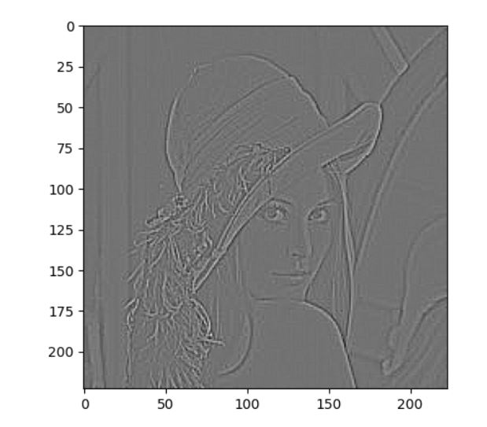
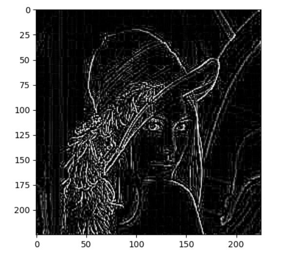

# Convolution walkthrough lab

1. **Le fichier image.jpg disponible dans votre environnement Vous avez également à votre disposition la variable conv_filter représentant un noyau de convolution (tableau numpy). Appliquez une convolution sur image à l'aide de la fonction filter2D d'OpenCV et stockez le résultat dans la variable convoluted_image. Vous veillerez à appliquer les paramètres suivants: ddepth = -1 ; kernel = conv_filter**

```python
import numpy as np
import cv2
conv_filter = np.array([[-1, -1, -1], [-1, 8, -1], [-1, -1, -1]])
img = cv2.imread('image.jpg')
convoluted_image = cv2.filter2D(img, -1, conv_filter)
```

2. **Explain what is the padding in the context of convolutions**

It relies on the idea that sometimes we do not want the convoluted image size to be smaller than the original one, therefore we will add zeros around it which is the padding. It allows passing normalized-size images to the dense layers

3. **Explain what is stride in the context of convolution**

The stride represents by how much pixels we will translate the current one from the original image to get to the next block which will be convoluted by the kernel, a high stride allows less computational intensity but a high stride could make us lose valuable information

4. **On dispose d'une image de 400 x  200 et on applique une convolution avec un stride de 1, pas de padding et une taille de kernel de 5x5. Donner la taille de l'image resultante**

conv_size_width = (W – F + 2P) / S + 1
=> conv_size = (400 - 5) + 1
=> conv_size = 396

Width : 396

conv_size = (H – F + 2P) / S + 1
=> conv_size = (200 - 5) + 1
=> conv_size = 196

Height : 196

5. **Convolution is used widely in image processing, particularly in Deep learning. It's so important to know how it works.In this exercise, you will implement a 2D convolution without padding and strides = 1 from scratch with Numpy and Python.Firstly, you will do this for a single patch of image.An 2D-array NumPy image of size (7,5) and a kernel of size (3,3) are stored in variables image and kernel. Calculate the output dimension of the convolution of image and kernel. Store  respectively the results in x-axis and y-axis in variables x_out and y_out. Create an array of zeros  output with the size (x_out, y_out).Flip the kernel both horizontally and vertically. Store the result in a variable kernel_flipped. Explain why we need to flip the kernel? Calculate the values output[0,0] and output[3,2].Now, you will implement the fully convolution by coding a function  named convolution_2D(image, kernel) that calculates the convolution of image and kernel. You could use the following procedure: Compute the output dimension of the output. Generate an array of zeros with the same shape as the output.Flip the kernel.Compute the values for output using a for loop.**

```python
import numpy as np
import cv2

image = np.random.randint(9, size=(7,5))
kernel = np.array([[1, 0, 1], [1, -1, 0], [0, 1, -1]])

width_conv_size = image.shape[0] - kernel.shape[0] + 1
height_conv_size = image.shape[1] - kernel.shape[1] + 1
x_out = width_conv_size
y_out = height_conv_size
output = np.zeros((x_out, y_out))
# The kernel should be flipped because
# the combinations start with the last pixel of the kernel
# with the first one of the original image.
kernel_flipped = cv2.flip(kernel, -1)
output[0][0] = np.sum(kernel_flipped * image[0:kernel_flipped.shape[0], 0:kernel_flipped.shape[1]])
output[3][2] = np.sum(kernel_flipped * image[3:6, 2:])

def convolution_2D(image, kernel):
    width_conv_size = image.shape[0] - kernel.shape[0] + 1
    height_conv_size = image.shape[1] - kernel.shape[1] + 1
    x_out = width_conv_size
    y_out = height_conv_size
    output = np.zeros((x_out, y_out))
    kernel_flipped = cv2.flip(kernel, -1)
    for i in range(0, output.shape[0]):
        for j in range(0, output.shape[1]):
            output[i][j] = np.sum(kernel_flipped * image[i:kernel_flipped.shape[0] + i, j:kernel_flipped.shape[1] + j])
    return output
```

6. **In this exercise, you will do the same thing as the previous exercise except for any value of padding and strides.Write a function named convolution_2D_padding(image, kernel, padding, strides) that calculates the cconvolution 2D of an image and kernel with padding and strides. You could use the following procedure:Compute the output size. Flip the kernel,Padding, Compute values for output using ‘for’ loops.**

```python
import numpy as np
import cv2

def convolution_2D_padding(image, kernel, padding=0, strides=1):
    padded_image = np.zeros((image.shape[0]+(padding*2), image.shape[1]+(padding*2)))
    padded_image[padding:padded_image.shape[0] - padding, padding:padded_image.shape[1] - padding] = image[padding:image.shape[0] - padding, padding:image.shape[1] - padding]
    width_conv_size = ((image.shape[0] - kernel.shape[0] + 2 * padding) / strides) + 1
    height_conv_size = ((image.shape[1] - kernel.shape[1] + 2 * padding) / strides) + 1
    x_out = int(width_conv_size)
    y_out = int(height_conv_size)
    output = np.zeros((x_out, y_out))
    kernel_flipped = cv2.flip(kernel, -1)
    i = 0
    j = 0
    lig = 0
    col = 0
    for i in range(0, output.shape[0]):
        for j in range(0, output.shape[1]):
            print(lig, col)
            output[i][j] = np.sum(kernel_flipped * padded_image[lig:kernel_flipped.shape[0] + lig, col:kernel_flipped.shape[1] + col])
            col+=strides
        col = 0
        lig+=strides
    return output
```

7. **Your environnment consists of an image of the famous Lena (the file name is "lena.png"). It consists also a kernel of edge detection filter_edge_detection. Load  the image in a grayscale and store it in a variable img. Using the library OpenCV, convolve the image and the kernel. Store the result in a variable conv_cv2. Using your function convolution_2D_padding(image, kernel, padding, strides) that you've implemented in the previous exercise, convolve the image and the kernel. Store the result in a variable conv_impl. Imshow both two image conv_cv2 and conv_impl. Did you see the difference between two pictures ?** 

```python
import numpy as np
import cv2
import matplotlib.pyplot as plt

filter_edge_detection = np.array([[-1, -1, -1], [-1, 8, -1], [-1, -1, -1]])

img = cv2.imread('lena.jpg', cv2.IMREAD_GRAYSCALE)

def convolution_2D_padding(image, kernel, padding=0, strides=1):
    padded_image = np.zeros((image.shape[0]+(padding*2), image.shape[1]+(padding*2)))
    padded_image[padding:padded_image.shape[0] - padding, padding:padded_image.shape[1] - padding] = image[padding:image.shape[0] - padding, padding:image.shape[1] - padding]
    width_conv_size = ((image.shape[0] - kernel.shape[0] + 2 * padding) / strides) + 1
    height_conv_size = ((image.shape[1] - kernel.shape[1] + 2 * padding) / strides) + 1
    x_out = int(width_conv_size)
    y_out = int(height_conv_size)
    output = np.zeros((x_out, y_out))
    kernel_flipped = cv2.flip(kernel, -1)
    i = 0
    j = 0
    lig = 0
    col = 0
    for i in range(0, output.shape[0]):
        for j in range(0, output.shape[1]):
            output[i][j] = np.sum(kernel_flipped * padded_image[lig:kernel_flipped.shape[0] + lig, col:kernel_flipped.shape[1] + col])
            col+=strides
        col = 0
        lig+=strides
    return output
    
conv_impl = convolution_2D_padding(img, filter_edge_detection)
conv_cv2 = cv2.filter2D(img, -1, filter_edge_detection)
plt.imshow(conv_impl, cmap="gray")
plt.imshow(conv_cv2, cmap="gray")
# The image convoluted from the OpenCv filter2D() function
# is darker and more blurred than the image gotten
# from the implemented convolution.
# In OpenCV's documentation, it is stated that :
# "The function does actually compute correlation, 
# not the convolution", because we did not flip the kernel
# and we did not set the anchor as required.
```

- Convoluted image gotten from personal implementation of 2D convolution :



- Convoluted image gotten from OpenCv filter2D() function :



8. 